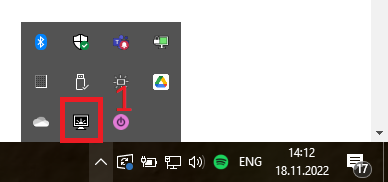
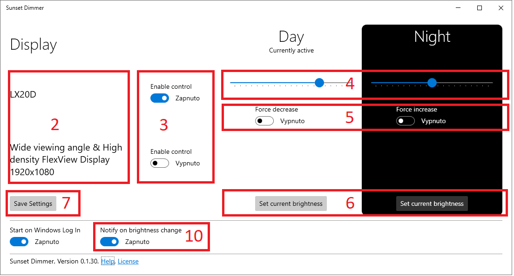
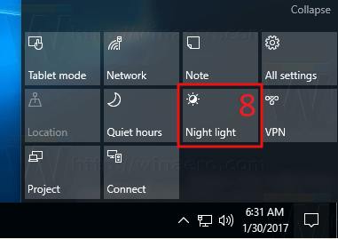
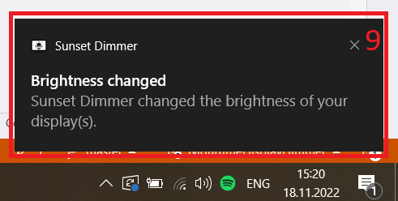

# Help and FAQ

Here you can find the answers to the questions asked most often.

## How does the Sunset Dimmer work?

The app works as a companion to the [Windows 10 Night light feature](https://support.microsoft.com/en-us/windows/set-your-display-for-night-time-in-windows-18fe903a-e0a1-8326-4c68-fd23d7aaf136). If you enable this feature and install this app, 
it will detect whether the Night mode was switched on or off and adjust your display brightness according to your preferred settings.

## Is my display supported?

I can't be sure, but probably yes. Generally, the app can control all laptop displays. Most of the standalone monitors can be controlled - even old ones. Even ten or more years old if connected by a digital interface - DVI-D, HDMI, DP).

Just make sure to enable **DDC/CI** in your display on-screen menu.

Unfortunately, some connector/signal converters do not support passing **DDC/CI** communication.

The app offers [two weeks trial](https://apps.microsoft.com/store/detail/9P6MXT53KF20) with no strings attached. You can verify display compatibility with no risk. 

## What Windows versions are supported?

Windows 10 version 1903 (May 2019 Update, build 10.0.18362) and up. This app is unfortunately NOT compatible with Windows ARM (yet).

## How to use the app?

* Make sure you have the [Night light Windows feature](https://support.microsoft.com/en-us/windows/set-your-display-for-night-time-in-windows-18fe903a-e0a1-8326-4c68-fd23d7aaf136) enabled and set up properly (I recommend enabling the automatic schedule).
* The app starts as an icon in the Windows toolbar notification area. 

* Start by double-clicking the app icon *(1)*.
* Wait for the app to load your supported displays *(2)*. 
* If you don't see your display, try to go through the display's on-screen menu, enable the **DDC/CI** feature, and close and reopen the app window.

* Use the toggle switches *(3)* to enable control of the displays you want to dim.
* After you enable the display, two sliders *(4)* and two toggle switches *(5)* (see below for more information) show up.
* Use the slider to set the desired brightness levels.
* Alternatively, you can use your display brightness controls (e.g., OSD menu or hotkeys on your laptop keyboard). After adjusting the settings, use the **Set current brightness** button *(6)* below to use the current setting as Day or Night preset.
* Save the configuration using the **Save** *(7)* button.
* Test the configuration by switching the **Night light** on or off using the button *(8)* in the Windows notification panel. After toggling the Night mode, the app will automatically adjust the brightness in a few seconds.

* A toast notification *(9)* should pop in your notification bar. You can disable the notifications using the setting in the Sunset Dimmer options window located under the display list.

## What do the Force increase/decrease options affect?

*Imagine the following situation:* You have the Sunset dimmer configured to dim your laptop display to 30% at night because there is some ambient lightning in your typical workplace. Now you are traveling and have manually adjusted your display brightness to the minimum to prolong the battery life. 
When the Night light turns on, the desired brightness is 30%, but the actual brightness is 0%, and the brightness would **increase**.

*A very similar rule applies to the day*: If the day preset is set to 75%, but you manually increased the brightness to 100% (e.g., you are on vacation and working in the morning near a window with direct sunlight shining on the display), the automatic change would **decrease** the brightness. 

Changing brightness in the above situations is generally not desired behavior. Sunset Dimmer won't adjust the brightness in such cases. But you can force the app to change brightness every time if your use case is different.

## Can I get the app for free?

> Short answer: *Yes*. Is it worth it? Probably no.

This app is Open Source, which means you can use the source code in [GitHub repository](https://github.com/oookoook/NighttimeDisplayDimmer) to build the app and use it completely free of charge. Your time is probably worth more than the app's price in Microsoft Store, even if you know what you are doing.

Building the app is quite a rocky road if you don't have experience with software development and the .NET framework.

## How can I report an issue or ask for help?

Either [create a GitHub issue] or send an e-mail to [sunsetdimmer@nastojte.cz](mailto:sunsetdimmer@nastojte.cz)
