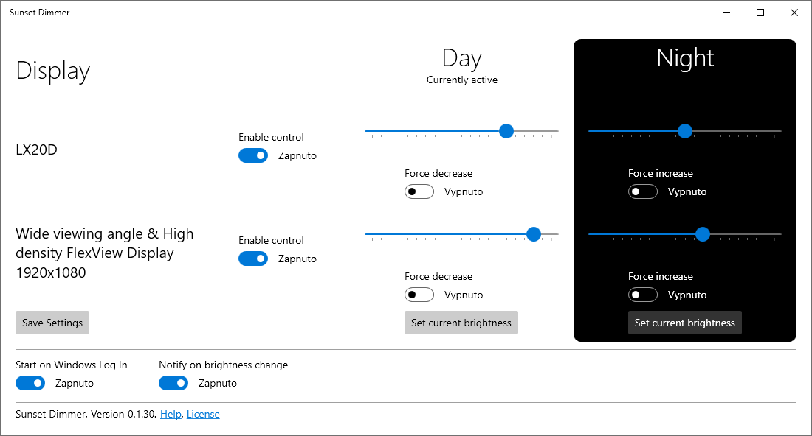

[Help](./help.html) • [License](./license.html)

# Sunset Dimmer

Magic tool to **save your eyes** when working on a computer at night. Automatically changes **brightness** of your displays at *sunset and sunrise**. **Set up once and forget.** Protect your eyes every day.

<ms-store-badge
	productid="9P6MXT53KF20"
	cid="github"
	window-mode="full"
	language="en"
	animation="on">
</ms-store-badge>

Are you a software developer, researcher, novelist, or copywriter? Do you often **work on your computer at night**? Chances are you battle **eye strain** caused by bright displays.

Windows 10 and 11 offer a great feature that helps your eyes called [Night light](https://support.microsoft.com/en-us/windows/set-your-display-for-night-time-in-windows-18fe903a-e0a1-8326-4c68-fd23d7aaf136). The Night mode reduces the amount of blue light emitted by the displays.

However, this feature has a significant drawback: it does not change display brightness. In many environments, you need bright displays during the day. But dimming the display for the night is too cumbersome using the display controls or external apps. You have to adjust the settings two times each day constantly.

The **Sunset Dimmer** takes this responsibility from you. Set up the desired **brightness levels** once, and the app will take care of the rest. It will automatically dim your displays when sunset comes and increase the brightness when you start working in the morning.

**Get the app** from the Microsoft Store, and your eyes will thank you!

<ms-store-badge
	productid="9P6MXT53KF20"
	cid="github"
	window-mode="full"
	language="en"
	animation="on">
</ms-store-badge>

